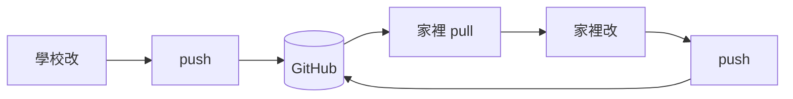
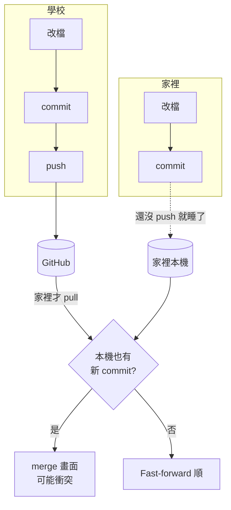
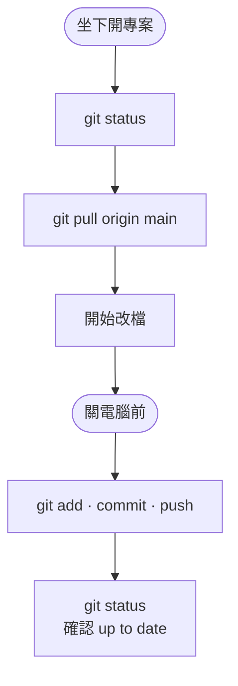
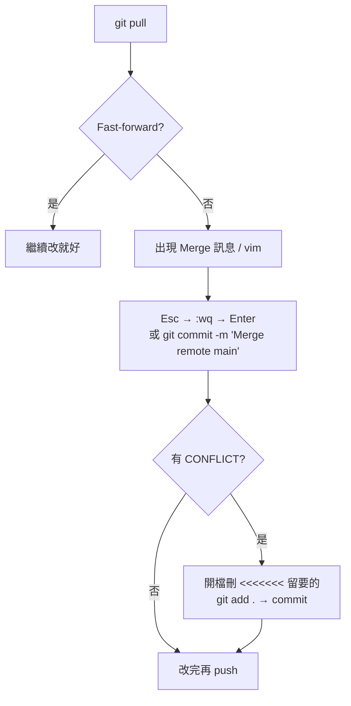

# Git 兩地協作筆記

> 學校 ↔ 家裡 · `Portfolio` · `main` · [GitHub](https://github.com/jekkinoopy/Portfolio)

---

## 你以為的流程（沒錯）



只要 **B 真的 push 成功**，且 **E 開工前一定先做 D**，通常不會衝突。

---

## 這幾天實際常變成這樣（分岔）



**一句話：** 兩邊都在 `main` 上各自 commit，又沒先對齊 → `pull` 只能 merge，不是 Git 壞掉。

---

## 每天只做兩段（兩台相同）



```powershell
# ① 開工
cd D:\Developer\projects\Portfolio
git status
git pull origin main

# ② 收工
git add .
git commit -m "type: 重點"
git push origin main
git status
```

| `git status` 寫法 | 意思 |
|-------------------|------|
| `up to date` | 好，可開工或已收工完成 |
| `behind N` | 遠端有新東西 → **先 pull** |
| `ahead N` | 這台有東西還沒 push → **先 push** 或先處理再換地點 |

---

## pull 出現什麼 → 怎麼辦



| 畫面 | 要做的事 |
|------|----------|
| `Fast-forward` | 正常，不用怕 |
| `Merge branch 'main' of ...` | 完成 merge commit（`:wq` 或 `-m`） |
| `CONFLICT` | 手動合併檔案 → `add` → `commit` |
| 卡在 `merging` | 完成 commit，或 `git merge --abort` |

不要在 **merging 中途** 再 pull 一次。

---

## 為什麼 Portfolio 特別容易撞（簡表）

| 原因 | 說明 |
|------|------|
| 熱門檔重疊 | `graphic.html`、`style.css`、`calendar-bag.html`、導覽 — 兩邊常一起改 |
| 忘記 push | 家裡 commit 了沒 push，學校又在舊版上改 |
| 忘記先 pull | 家裡先改才 pull，本機已有 commit → 必 merge |
| 大檔 | 單檔 >100MB push 會失敗，曾用 `reset --soft` 重寫歷史 |

---

## 亂了時貼這三行

```powershell
git status
git log --oneline -8
git log --oneline origin/main -5
```

- 只有 **behind** → 忘記 pull  
- 只有 **ahead** → 忘記 push  
- **都有** → 分岔，要 merge  

---

## 備註（2026-05-28）

- 當時家裡已與 `origin/main` 同步，無進行中 merge。  
- 待辦 → `z_notes/00_TOMORROW_TODO.md`  
- 全站頁表（可點）→ `z_misc/site-guide/`  
- 檔案分類規則 → `z_notes/02_專案檔案結構.md`

---

## 分岔一句話

```
學校 ──commit──► GitHub ◄──commit── 家裡
         ▲                    │
         └──── 兩邊都先 commit 才 pull ────┘  → 一定要 merge
```
